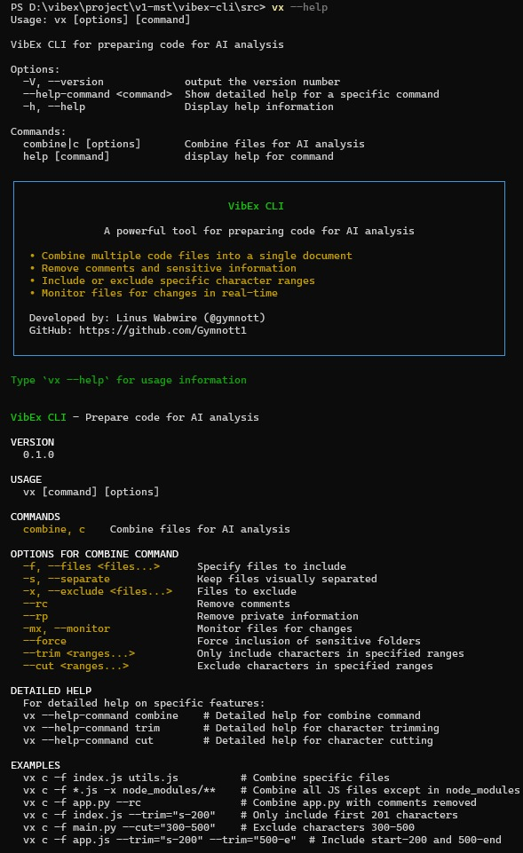
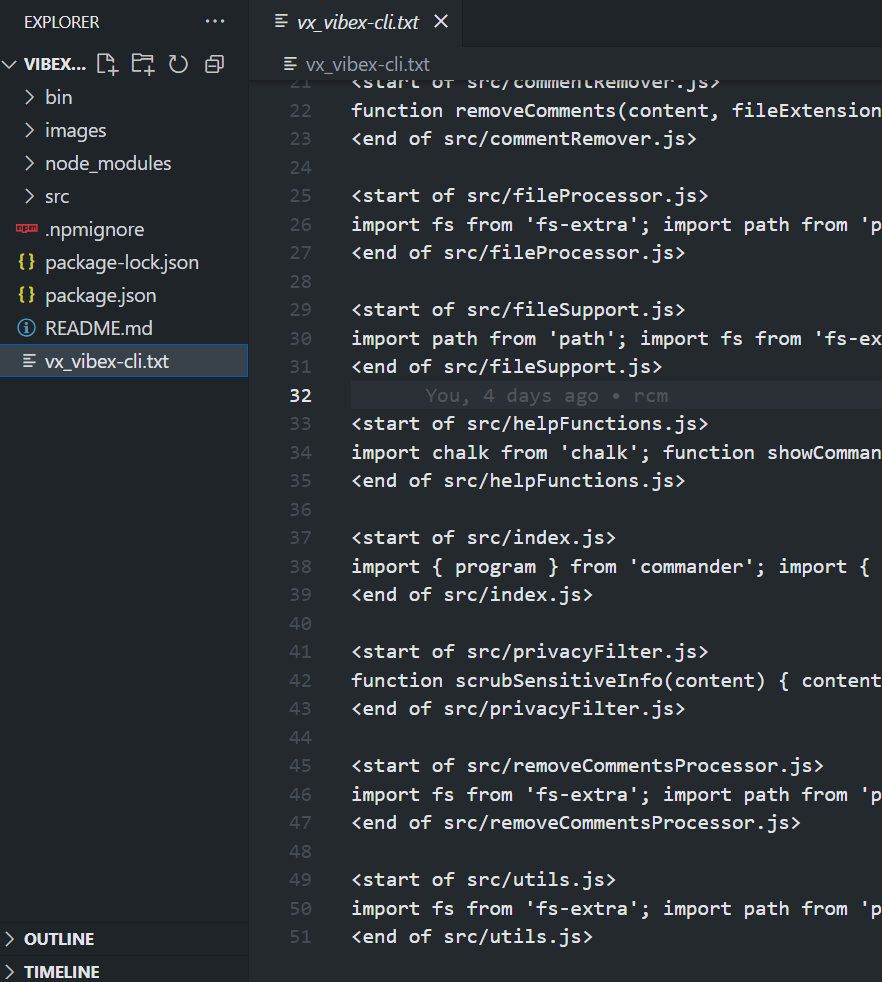
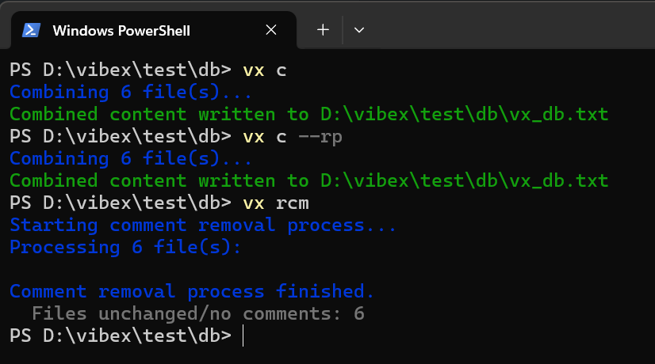

# VibEx CLI

[](https://www.npmjs.com/package/vibex-cli)
[](https://opensource.org/licenses/MIT)

VibEx (`vx`) is a developer-friendly CLI tool that streamlines the process of working with AI coding assistants. It helps developers prepare, consolidate, and clean code for AI analysis without exposing sensitive information.


Imagine needing to share your code with an AI assistant—only to discover that your context window is clogged with hundreds of lines of comments, private API keys, email addresses, phone numbers, personal tokens, secret codes, and more. Worse yet, you have entire code blocks you’d prefer to keep hidden from prying eyes. These headaches are exactly why you need **Vibex-CLI**.

**Vibex-CLI** is designed to:

* **Strip Out Noise & Secrets**
  Automatically remove comments and any file or folder matching sensitive patterns (e.g., `.git/`, `node_modules/`, and your own custom “secret” paths).
* **Consolidate Your Context**
  Gather all of your code’s relevant files into a single, clean text file—named `vx_{your_project_name}.txt`—so you can feed one streamlined document into any AI assistant.
* **Customize to Your Workflow**
  Configure exactly which files, folders, or patterns to include or exclude. Use it across projects of any size and structure.
* **Keep Private Data Private**
  Built-in filters safeguard your API keys, tokens, and other secrets, so you never accidentally expose them when collaborating or querying an AI model.

With **Vibex-CLI**, you eliminate the friction of context-window limits and secret-leak anxiety. Just run a single command, point it to your project directory, and voilà—you have one neat, secure text file ready for AI-powered code review, refactoring, or generation. Secure, flexible, and totally under your control—Vibex-CLI is your all-in-one solution for code sharing with confidence.

Lets make AI coding easy and secure !!!!! 💥💥⭐🥳







## 🚀 Features

- **Combine multiple files** into a single document for AI analysis
- **Remove comments** to reduce token usage and noise
- **Scrub sensitive information** like API keys and personal data
- **Monitor files** for changes and auto-update the combined output
- **Character trimming** to include only specific parts of files
- **Character cutting** to exclude specific parts of files
- **Support for many file types** with varying levels of processing
- **Highly configurable** with simple command line options

## 📦 Installation

```bash
npm install -g vibex-cli
```
# Installing `vibex-cli` on Linux

This guide walks you through installing the `vibex-cli` package globally on a Linux system using npm, while avoiding permission issues that often arise when installing global packages.

---

## Step 1: Configure npm to Use a User-Specific Directory

By default, npm installs global packages in a system directory (e.g., `/usr/lib/node_modules`), which requires root access and can lead to permission errors. To avoid this, configure npm to install global packages in a directory within your home folder, such as `~/.npm-global`.

Run this command to set the new prefix:

```bash
npm config set prefix '~/.npm-global'
```

This is a one-time setup. After running this, all future global npm installations will use `~/.npm-global` instead of the system directory.

---

## Step 2: Update Your PATH

To run globally installed packages (like `vibex-cli`) from anywhere in the terminal, you need to add the new global `bin` directory (`~/.npm-global/bin`) to your system's PATH. The PATH is an environment variable that tells your shell where to look for executable files.

Depending on your shell, add the appropriate line to your shell configuration file:

- **For Bash** (typically `~/.bashrc`):

  ```bash
  echo 'export PATH=~/.npm-global/bin:$PATH' >> ~/.bashrc && source ~/.bashrc
  ```

- **For Zsh** (typically `~/.zshrc`):

  ```bash
  echo 'export PATH=~/.npm-global/bin:$PATH' >> ~/.zshrc && source ~/.zshrc
  ```

- **For other shells** (e.g., `~/.profile`):

  Append this line to the relevant configuration file:

  ```bash
  export PATH=~/.npm-global/bin:$PATH
  ```

  Then, reload the configuration file:

  ```bash
  source ~/.profile
  ```

This step ensures that your shell can find the `vibex-cli` executable after installation.

---

## Step 3: Install `vibex-cli` Globally

With npm configured and your PATH updated, you can now install `vibex-cli` without needing `sudo` or encountering permission errors. Run the following command:

```bash
npm install -g vibex-cli
```

This installs `vibex-cli` in `~/.npm-global/lib/node_modules`, and its executable will be placed in `~/.npm-global/bin`, which is now accessible via your PATH.

---

## Verify the Installation

To confirm that `vibex-cli` is installed and working, run:

```bash
vibex-cli --version
```

If this command outputs a version number, the installation was successful!


## 🔧 Usage

### Basic Commands

```bash
# Combine all files in current directory
vx c

# Combine specific files
vx c -f app.js config.js

# Combine files but exclude some
vx c -x node_modules/ .env

# Remove comments from combined output
vx c --rc

# Remove sensitive information
vx c --rp

# Combine both options
vx c --rc --rp

# Monitor files for changes
vx c -mx

# Remove comments from inside single folders files
vx rcm
```

### Output

By default, VibEx creates a file named `vx_{folder_name}.txt` in the current directory containing the combined and processed content.

## 🛠️ Command Options

| Command | Alias | Description |
|---------|-------|-------------|
| `c` | `--combine` | Combine files for AI analysis |
| `-f <files...>` | `--files <files...>` | Specify files to include |
| `-s` | `--separate` | Keep files visually separated in output |
| `-x <files...>` | `--exclude <files...>` | Files or directories to exclude |
| `--rc` | `--remove-comments` | Remove code comments |
| `--rp` | `--remove-private` | Remove private/sensitive information |
| `-mx` | `--monitor` | Monitor files for changes and update output |
| `--trim <ranges...>` | | Only include characters in specified ranges |
| `--cut <ranges...>` | | Exclude characters in specified ranges |
| `--force` | | Force inclusion of sensitive folders |

## ✨ Examples

### Combining Multiple JavaScript Files

```bash
vx c -f src/app.js src/utils.js src/api.js
```

Creates a file `vx_app.js.txt` containing the combined contents of all three files.

### Preparing Code for AI Review Without Sensitive Info

```bash
vx c --rc --rp
```

Combines all files in the current directory, removes comments, and scrubs sensitive information.

### Setting Up Automatic Updates for a Project

```bash
vx c -mx
```

Creates a combined file that automatically updates when any source file changes.

### Working with Specific Files While Excluding Others

```bash
vx c -f src/ -x src/tests/ src/deprecated/
```

Combines all files in the `src/` directory except those in the `tests/` and `deprecated/` subdirectories.

### Including Only Specific Parts of Files

```bash
vx c -f large-file.js --trim="s-200" --trim="500-e"
```

Combines only the first 200 characters and from position 500 to the end of the file.

### Excluding Specific Parts of Files

```bash
vx c -f app.js --cut="300-500"
```

Combines the file while excluding characters from position 300 to 500.

## 🔍 Advanced Features

### Character Range Trimming

The `--trim` option allows you to specify character ranges to include in the output:

```bash
# Include only characters 100-500
vx c -f app.js --trim="100-500"

# Include from start to position 200
vx c -f app.js --trim="s-200"

# Include from position 500 to end
vx c -f app.js --trim="500-e"

# Include multiple ranges
vx c -f app.js --trim="s-200" --trim="500-e"
```

### Character Range Cutting

The `--cut` option allows you to specify character ranges to exclude from the output:

```bash
# Exclude characters 100-500
vx c -f app.js --cut="100-500"

# Exclude from start to position 100
vx c -f app.js --cut="s-100"

# Exclude from position 500 to end
vx c -f app.js --cut="500-e"

# Exclude multiple ranges
vx c -f app.js --cut="100-200" --cut="400-500"
```

### Combining Trim and Cut

You can combine trim and cut operations for precise control:

```bash
vx c -f app.js --trim="s-1000" --cut="200-300"
```

This includes only the first 1000 characters but excludes the characters from 200-300.

## 📊 File Type Support

VibEx supports various file types with different levels of processing:

### Full Support
JavaScript, TypeScript, Python, HTML, CSS, Markdown, JSON, and more.

### Partial Support
Ruby, Go, Swift, Kotlin, Java, C/C++, PHP, Rust, Shell scripts, and more.

### Basic Support
Plain text, CSV, INI, configuration files, environment variables, and more.

## 🔒 Privacy Protection

The `--rp` flag identifies and replaces these patterns:

- API keys → `"API_KEY"`
- Authentication tokens → `"AUTH_TOKEN"`
- Email addresses → `"example@email.com"`
- Phone numbers → `"+123456789"`
- Numeric codes → `"11111"`
- Personal names → `"FIRST_NAME"`

## 💬 Comment Removal

The `--rc` flag removes comments from many languages including:

- JavaScript/TypeScript (`//`, `/*...*/`)
- Python (`#`, docstrings)
- HTML/XML (`<!-- -->`)
- CSS (`/*...*/)
- Shell scripts (`#`)
- Ruby (`#`, `=begin...=end`)
- And many more

## 🔄 Monitoring Changes

The monitoring feature (`-mx`) watches for file changes in real-time:

```bash
vx c -f src/ -mx
```

When any monitored file changes, VibEx automatically updates the combined output file.

# New Function Remove Comments Inside Files (vx remove-comments / vx rcm)

⚠️ **WARNING**: This command modifies your files directly **IN PLACE**!
There is no undo feature. It is strongly recommended to commit your code to version control (like Git) or create a backup before running this command.

## Overview

This command allows you to remove comments from your source code files based on language-specific comment syntax (e.g., `//`, `/* */`, `#`, `<!-- -->`). It processes files found in the current directory and subdirectories by default, or specific files/patterns you provide, overwriting the original files with the comment-free version.

## Syntax

```bash
vx remove-comments [options] [-f <files...>] [-x <patterns...>]
# Alias:
vx rcm [options] [-f <files...>] [-x <patterns...>]
```

## Common Options

- `-f, --files <files...>`: Specify the target files or glob patterns (e.g., "src/**/*.js", main.py). If omitted, it scans the current directory for supported file types (respecting excludes).

- `-x, --exclude <patterns...>`: Specify glob patterns for files or directories to exclude (e.g., "**/tests/**", vendor/**). By default, node_modules/** and vx_*.txt are excluded.

- `--force`: Include files in normally excluded directories (like node_modules). Use carefully.

## Examples

1. Remove comments from all supported files in the project (run from project root):
   ```bash
   vx rcm
   ```

2. Remove comments from a specific file:
   ```bash
   vx rcm -f src/utils.py
   ```

3. Remove comments from all JavaScript files in the src directory:
   ```bash
   # Make sure to quote the glob pattern
   vx rcm -f "src/**/*.js"
   ```

4. Remove comments from all supported files, but skip the build folder and all test files:
   ```bash
   vx rcm -x "build/**" -x "**/*test*.py" -x "**/*.spec.js"
   ```

## Getting Help

For detailed options and information specific to this command:
```bash
vx rcm --help
```


## 🔄 Advanced Features

- **Character Range Trimming**: Include only specific parts of your code
- **Character Range Cutting**: Exclude specific parts of your code
- **Comment Removal**: For multiple programming languages
- **File Monitoring**: Auto-update when source files change
- **Remove Comments In-Place**: New `rcm` command to clean files directly


## 🤝 Contributing

Contributions are welcome! Check out our [Contributing Guide](CONTRIBUTING.md) for details on:

1. Fork the repository
2. Create your feature branch (`git checkout -b feature/amazing-feature`)
3. Commit your changes (`git commit -m 'Add some amazing feature'`)
4. Push to the branch (`git push origin feature/amazing-feature`)
5. Open a Pull Request

### Areas for Contribution

- Additional language support for comment removal
- Better regex patterns for identifying sensitive information
- Performance improvements for large codebases
- Support for additional file formats
- Integration with development tools and platforms
- Adding support for handling images and media files

## 📄 License

This project is licensed under the MIT License - see the [LICENSE](LICENSE) file for details.

## 🙏 Acknowledgments

- Inspired by the challenges developers face when working with AI coding assistants
- Built with open-source tools and community support
- Developed by Linus Wabwire alias gymnott and other open source community developers 


*Tags: code security, AI coding assistant, sensitive data protection, secure coding, developer tools, data privacy, API key protection, code sanitization, AI prompt engineering, context window optimization, credential protection, secure development, code sharing tools, PII protection, developer security, AI code assistance, secure AI integration, code privacy, token optimization, CLI tools, developer productivity*


---

📣 **Found VibEx helpful?** Star us on GitHub and share your experience!

💡 **Have ideas for improvements?** Open an issue or submit a pull request!
